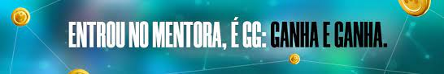

# Mentora.gg

The only blockchain platform where gamers connect, compete and win money while having fun with their favourite games

The great differential of cryptogames for the traditional gaming market is
that they reward their players in crypto assets, instead of electronic
currencies in the companies' databases. Thus, through a digital economy
and a secondary trading market, they manage to generate purchasing
power outside the virtual world for their players.

## The Contracts

- The MWP(Mentora Well Played Token): The Governance tokens are aimed at those who want to invest and have an
  active participation in project decisions (it will be the Public Offer sale
  token). It is also a deflationary asset that can generate passive income
  while in your portfolio if added to the staking pool in the future.

- The Vendor contract: This contracts is in charge of make the ICO of Mentora token.

Those contracts are deployed by the WEB3 Developer team on Polygon Network:
MWP Token: https://polygonscan.com/address/0xe0f13a9eaec9d5b9817420fd2ea76f00734dfba5

Vendor Contract: https://polygonscan.com/address/0x3259cf7eee9090099394f2cbd417d19c426f776e
